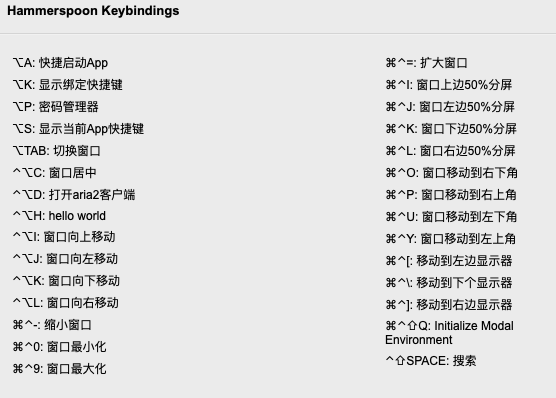

# 自定义Hammerspoon配置

- modules 自定义模块
- Spoons 插件

## Get started

1. Install [Hammerspoon](http://www.hammerspoon.org/) first.

2. `git clone https://github.com/fengjx/my-hammerspoon.git ~/.hammerspoon`

3. Reload the configutation.

## Keep update

`cd ~/.hammerspoon && git pull`

### usage

